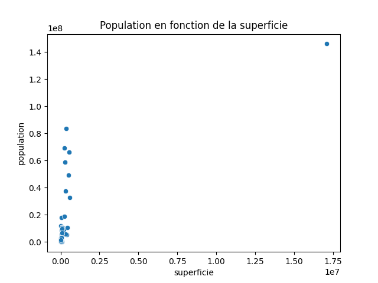
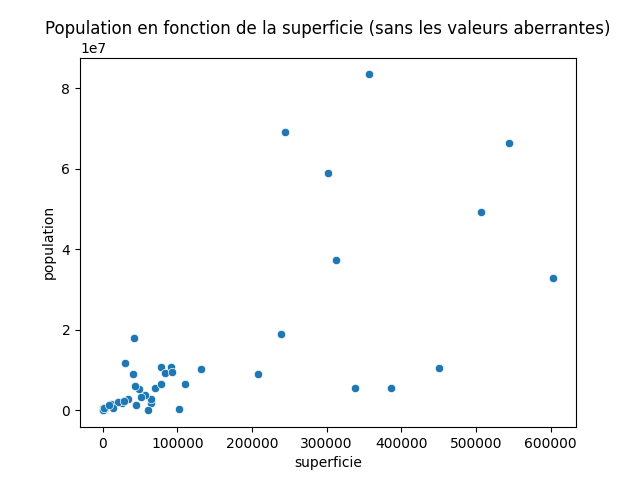

# Analyse bivariée
## superficie / population

On observe une valeur aberrante. Il s'agit de la russie. Dans la suite de l'analyse, on ne considère pas cette valeur.

Une corrélation linéaire entre la superficie et la population ne semble pas évidente.

Le dataset comporte nom                   53
capital               53
population            53
superficie            53
langue                53
densite_population    53
dtype: int64 lignes.

Coefficient de corrélation de *Pearson* : 0.7219781108591069.
pvalue test de non-correlation de *Pearson* : 1.0543492352085533e-09.

Le coefficient de corrélation de Pearson confirme l'observation graphique. Il n'y a pas de corrélation linéaire entre superficie et population.
